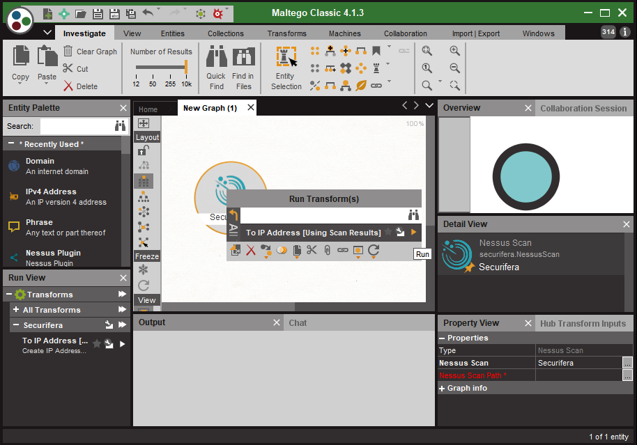
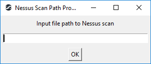
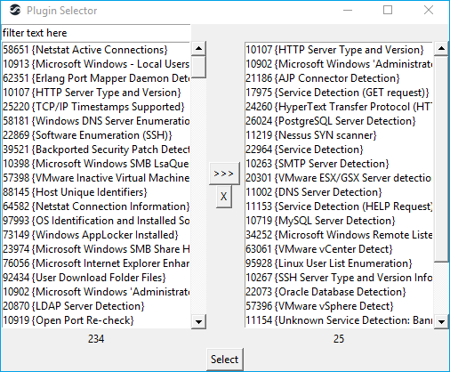
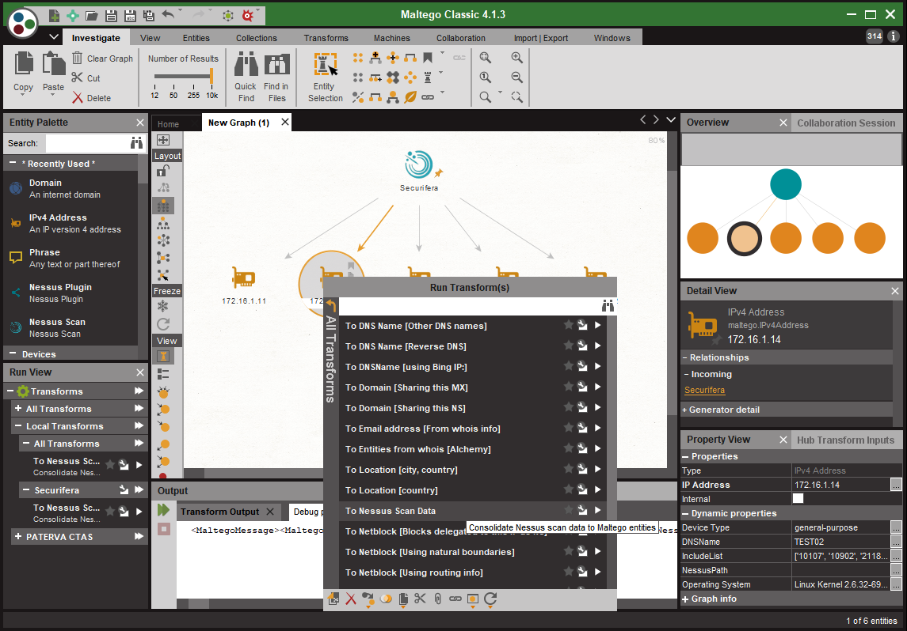
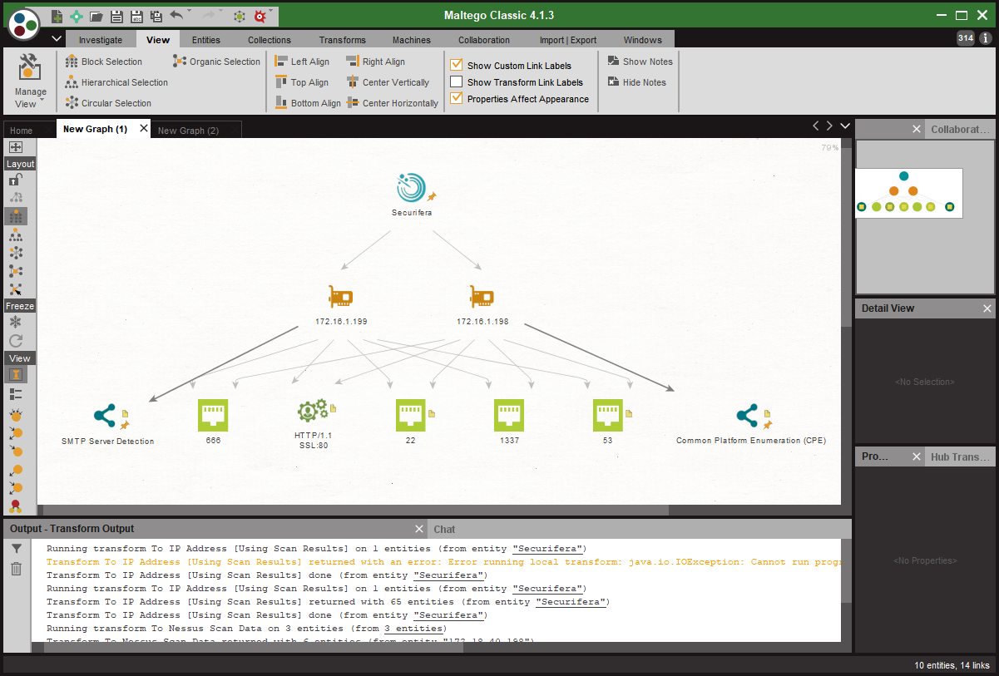

MaltegoNessusParser
===================

Maltego transform that processes raw Nessus scan files and creates native and
custom entities representing hosts and outcome data

 

Install
-------

-   Create transforms directory in the Maltego install directory

    ~~~~~~~~~~~~~~~~~~~~~~~~~~~~~~~~~~~~~~~~~~~~~~~~~~~~~~~~~~~~~~~~~~~~~~~~~~~~
    C:\Program Files (x86)\Paterva\Maltego\v4.1.0\securifera-transforms
    ~~~~~~~~~~~~~~~~~~~~~~~~~~~~~~~~~~~~~~~~~~~~~~~~~~~~~~~~~~~~~~~~~~~~~~~~~~~~

-   Copy python scripts and supporting file to this directory (found in the
    securifera-transforms directory of repository)

-   Import MTZ file into Maltego

    -   Select *Import/Export* tab in Maltego

    -   Select *Import Config*

    -   Select **MaltegoNessusParser.mtz** from repository

    -   Confirm all entities, transforms, and other items are checked

-   Install prerequisites

    -   Install Python (Only tested on 2.7 currently)

    -   Install python ipaddress libraries

        -   pip install ipaddress

    -   Install python Tkinter libraries (not necessary on Windows I think)

        -   apt-get install python-tk

 

Usage
-----

-   Drag **NessusScan** entity into the a new Maltego graph

-   Right click and select the **To IP Address [Using Scan Results]** transform

-   If the **Nessus Scan Path** property has not been set the user will be
    prompted

-   Plugin selection screen will appear to apply filters on plugins being
    included during processing

-   **IPv4Address** entities will be created from all unique hosts in Nessus
    scans

-   Right click the **IPv4Address** entities and select **To Nessus Scan Data**
    transform

-   Entities will be created for services, ports, and various other plugin
    output data

